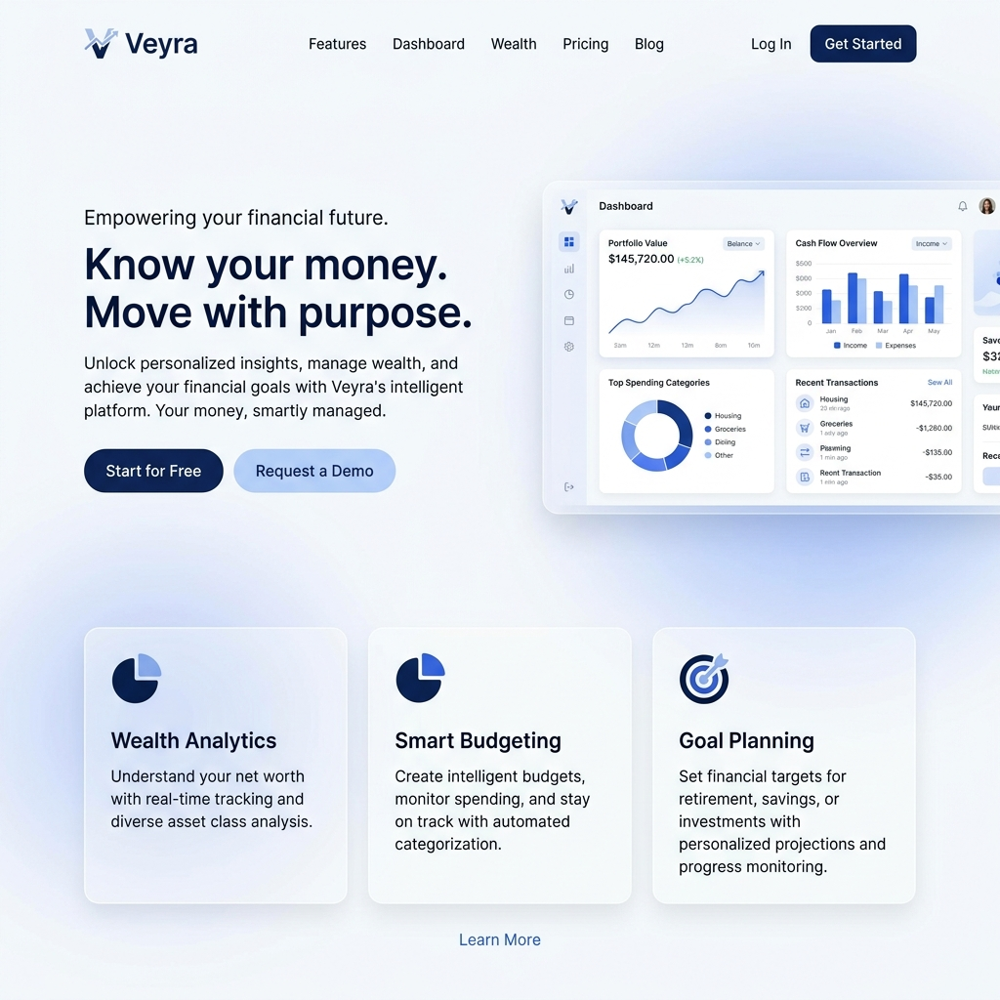
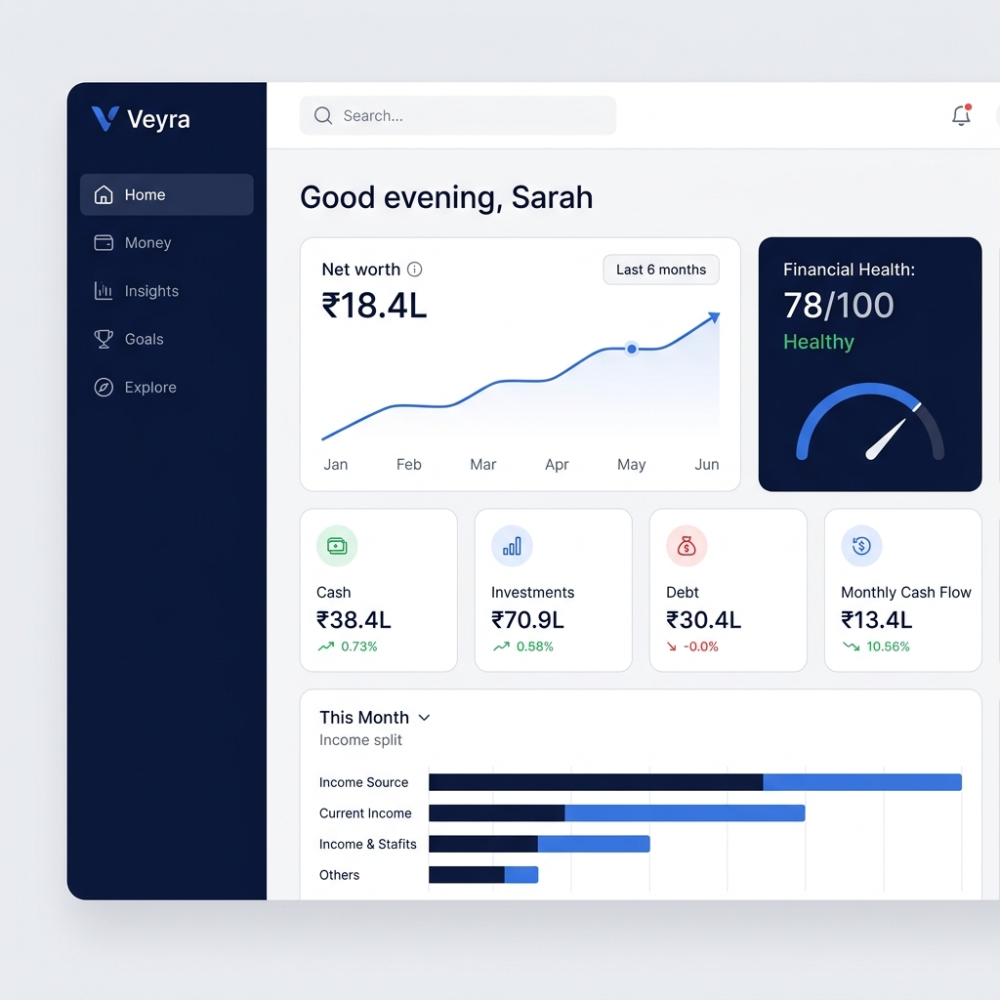
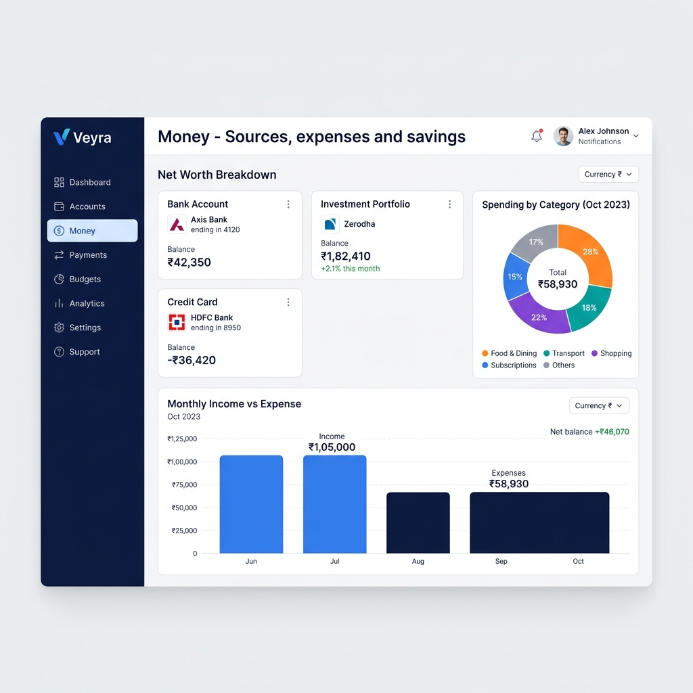
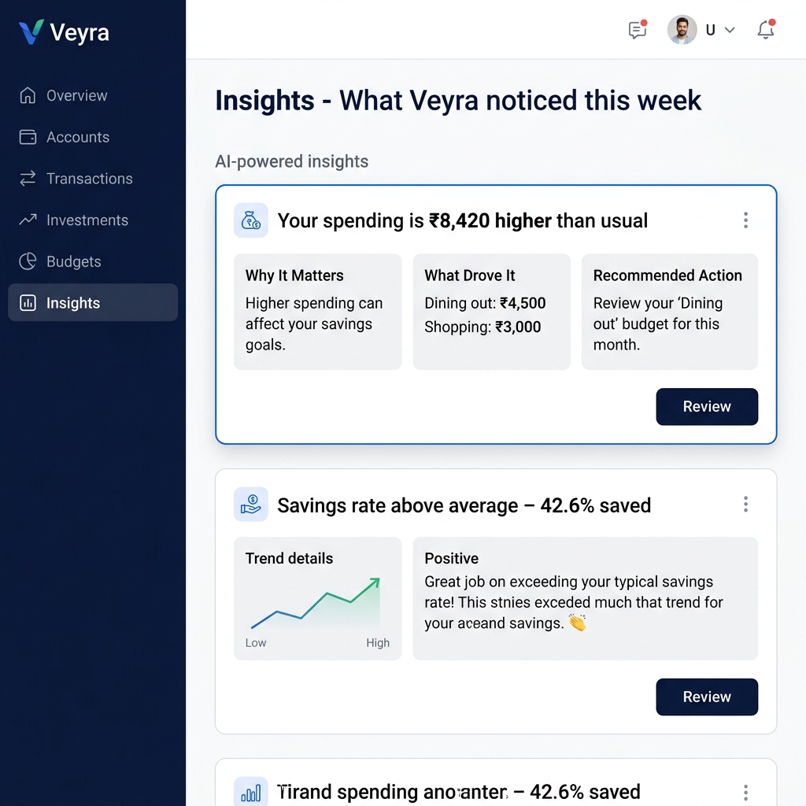
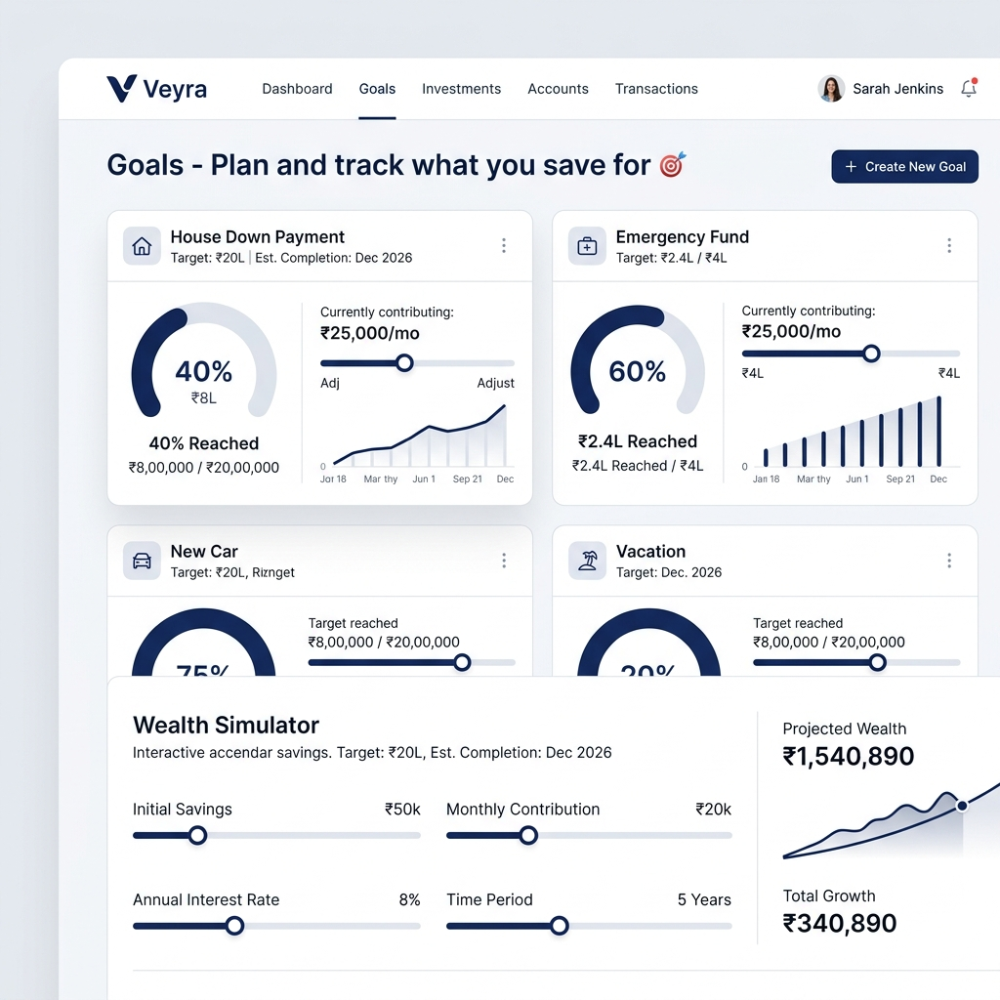
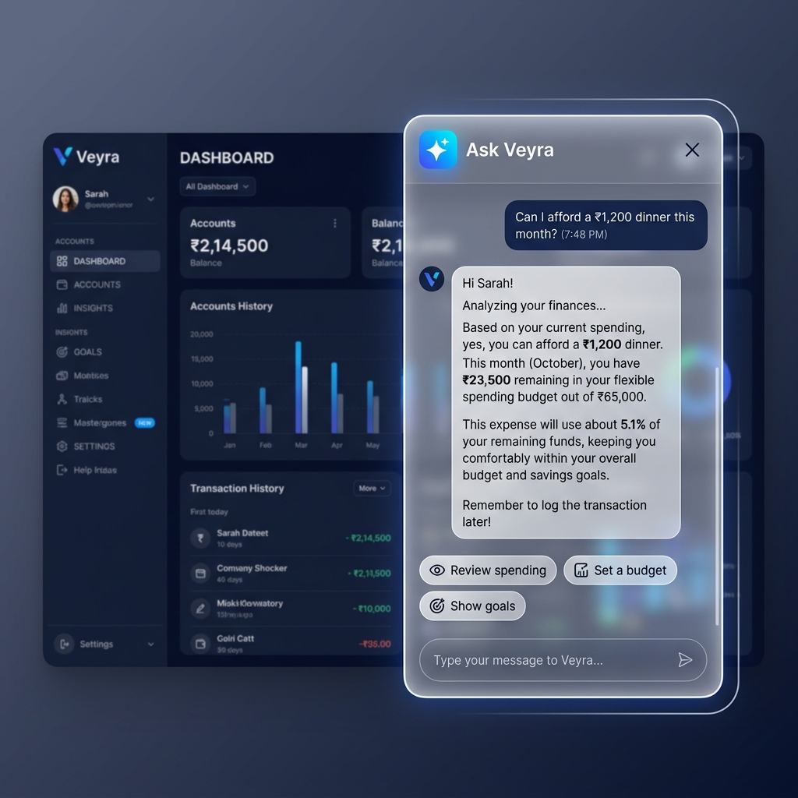

# ✦ Veyra — Personal Financial Intelligence Platform

> **Know your money. Move with purpose.**  
> Veyra (Fermor) brings your accounts together, explains financial movements in plain language, surfaces AI insights, and helps you plan your financial future with confidence.

---

## 📸 App Screenshots

| Landing | Dashboard Home |
|:---:|:---:|
|  |  |

| Money & Accounts | AI Insights |
|:---:|:---:|
|  |  |

| Goal Tracker | Ask Veyra AI |
|:---:|:---:|
|  |  |

---

## 🌟 Key Features

* **📊 Money at a Glance (Dashboard)**: Real-time net worth tracking, liquid cash breakdown, investment balances, debt utilization, and monthly cash flow metrics.
* **🤖 AI Intelligence ("Veyra Noticed")**: Contextual observations that explain *why* your health score moved, flagging unusual spending spikes, emergency fund progress, and savings rate optimization.
* **🎯 Goal Tracking & Wealth Simulator**: Interactive goal cards for house down payments, emergency funds, and retirement with dynamic monthly contribution projection sliders.
* **🛡️ Financial Health Score (0–100)**: Transparent scoring engine breaking down positive and negative factors affecting your financial stability.
* **🛠️ Financial Tools & Explore Suite**: Embedded calculators for loan comparisons, FIRE planning, tax planning, and investment compounding.
* **💬 Floating AI Assistant ("Ask Veyra")**: Context-aware AI assistant accessible across every screen via FAB button or `Ctrl+J` keyboard shortcut.
* **🎨 State-of-the-Art Design System**: Light & soft glassmorphism, customizable accent color switching (Blue, Emerald, Purple, Amber), 100% responsive drawer navigation, and WCAG 2.1 AA contrast compliance.

---

## 🚀 Tech Stack

| Domain | Technology |
| :--- | :--- |
| **Framework** | [React 19](https://react.dev/) + [Vite 8](https://vitejs.dev/) |
| **Language** | [TypeScript](https://www.typescriptlang.org/) (Strict Mode) |
| **Styling** | [Tailwind CSS v4](https://tailwindcss.com/) + CSS Design Tokens |
| **Routing** | [React Router v7](https://reactrouter.com/) (Lazy-loaded code splitting) |
| **Animations** | [Framer Motion](https://www.framer.com/motion/) |
| **Data Viz** | [Recharts](https://recharts.org/) |
| **Icons** | [Lucide React](https://lucide.dev/) |
| **Deployment** | [Vercel](https://vercel.com/) |

---

## 📂 Project Structure

```text
Veyra/
│
├── screenshots/                       # App preview screenshots
│   ├── landing-page.png
│   ├── home.png
│   ├── money.png
│   ├── insights.png
│   ├── goals.png
│   └── ask-veyra.png
│
├── docs/                              # Product, UX & Architecture documentation
│   ├── UX.md                          # UX design principles, tokens & accessibility
│   ├── PRODUCT.md                     # Product vision, features & roadmap
│   └── ARCHITECTURE.md               # Technical system architecture & code spec
│
├── design_system/                     # Complete Veyra Design System
│   ├── Foundations/                   # Color, typography, spacing, motion, elevation
│   ├── Architecture/                  # App shell, header, sidebar, section specs
│   ├── Layout/                        # Dashboard layout, grid & responsive specs
│   ├── Components/                    # Component-level specifications
│   ├── Patterns/                      # Dashboard & page layout patterns
│   ├── Interaction/                   # Animation & micro-interaction rules
│   ├── States/                        # Empty, loading, error & skeleton states
│   ├── Ux_writing/                    # Voice, tone & copy guidelines
│   ├── technical/                     # Technical implementation guidelines
│   ├── Deisgntokens/                  # Design token references
│   ├── AI Rules/                      # AI agent build rules
│   └── UX_UI_Design_Audit_Report.md  # Full UX/UI audit report (Aug 2026)
│
├── Frontend/                          # React Web Application
│   ├── public/                        # Static assets & favicons
│   ├── src/
│   │   ├── app/                       # App routes & Error Boundaries
│   │   ├── components/
│   │   │   ├── brand/                 # Veyra logo & brand lockups
│   │   │   ├── layout/                # AppShell, Header, Sidebar, MobileNav
│   │   │   ├── shared/                # Cross-cutting shared components
│   │   │   ├── ui/                    # Buttons, Cards, Dialogs, Dropdowns
│   │   │   └── visuals/               # Background patterns & artwork
│   │   ├── features/
│   │   │   ├── assistant/             # Floating AI Assistant
│   │   │   ├── connect/               # Account connection flow
│   │   │   ├── explore/               # Financial calculators & tools
│   │   │   ├── goals/                 # Goal tracker & simulator
│   │   │   ├── home/                  # Main dashboard
│   │   │   ├── insights/              # AI insights feed
│   │   │   ├── landing/               # Product landing page
│   │   │   ├── money/                 # Accounts & spending deep-dive
│   │   │   ├── plans/                 # Pricing & subscription plans
│   │   │   └── settings/              # Workspace & appearance settings
│   │   ├── hooks/                     # useResponsive, useFocusTrap, etc.
│   │   ├── lib/                       # Formatting, page theme helpers
│   │   ├── data/                      # Mock data & static datasets
│   │   ├── config/                    # App configuration constants
│   │   ├── types/                     # Global TypeScript types
│   │   └── styles/                    # tokens.css, globals.css, typography.css
│   ├── vercel.json                    # SPA rewrite config
│   ├── vite.config.ts                 # Vite build & vendor chunk rules
│   ├── package.json
│   └── README.md                      # Frontend quickstart
│
├── .gitignore
├── vercel.json                        # Root Vercel deployment config
└── README.md                          # ← You are here
```

---

## 📖 Documentation

| Document | Description |
| :--- | :--- |
| [docs/UX.md](./docs/UX.md) | UX design philosophy, token system, typography scale, responsive breakpoints & WCAG accessibility |
| [docs/PRODUCT.md](./docs/PRODUCT.md) | Product vision, feature specs, and phased roadmap |
| [docs/ARCHITECTURE.md](./docs/ARCHITECTURE.md) | Technical architecture, code-splitting strategy, bundle optimization & deployment |
| [design_system/UX_UI_Design_Audit_Report.md](./design_system/UX_UI_Design_Audit_Report.md) | Full UX/UI Design Audit & Refinement Report (Aug 2026) |

---

## 🛠️ Getting Started Locally

### Prerequisites
Make sure you have **Node.js (v18+)** and **npm** installed.

### 1. Clone the Repository
```bash
git clone https://github.com/your-username/fin.git
cd fin/Frontend
```

### 2. Install Dependencies
```bash
npm install
```

### 3. Start Development Server
```bash
npm run dev
# → http://localhost:5173
```

---

## 📦 Build & Deploy

```bash
# Production build (type-check + Vite bundle)
npm run build

# Preview production build locally
npm run preview
```

### Deploy to Vercel
1. Push to GitHub.
2. Import repository on [vercel.com](https://vercel.com).
3. Vercel auto-detects Vite — click **Deploy**.

---

## 📄 License

Created for Veyra / Fermor Wealth Workspace. All rights reserved.
