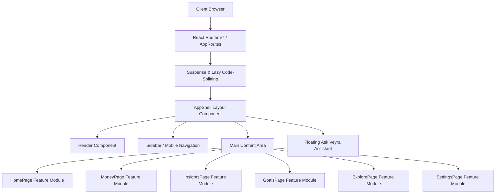

# Veyra — Technical Architecture & Code Specification

## 1. System Architecture

Veyra is engineered as a modern, high-performance Single Page Application (SPA) leveraging **React 19**, **Vite 8**, **TypeScript**, and **Tailwind CSS v4**.



---

## 2. Technical Stack Specifications

* **Frontend Framework**: React 19 (`react`, `react-dom`, `react-router`)
* **Build System**: Vite 8 with `@vitejs/plugin-react` & `@tailwindcss/vite`
* **Type System**: TypeScript (Strict mode enabled)
* **Styling**: Tailwind CSS v4 + Design Tokens (`src/styles/tokens.css`, `globals.css`)
* **Animations**: Framer Motion & CSS keyframes (`animate-grow-x`, `animate-pulse`)
* **Charts**: Recharts (`ResponsiveContainer`, `AreaChart`, `BarChart`, `PieChart`)
* **State Management**: React Context (`AskFermorContext`), Zustand & React Hooks

---

## 3. Performance & Bundle Optimization

### Route-Level Dynamic Code-Splitting
Pages are dynamically imported using `React.lazy()` to ensure minimal initial bundle sizes:

```tsx
const HomePage = lazy(() => import("@/features/home/pages/HomePage"));
const GoalsPage = lazy(() => import("@/features/goals/pages/GoalsPage"));
const MoneyPage = lazy(() => import("@/features/money/pages/MoneyPage"));
```

### Vendor Chunking (`vite.config.ts`)
Rollup `manualChunks` divides the application into three optimized vendor chunks:
* `vendor`: Core React & React Router libraries (`235 kB`)
* `ui`: Framer Motion, Lucide icons, and utility helpers
* `charts`: Recharts data visualization library (`397 kB`)

---

## 4. File Directory Standard

```text
src/
├── app/                  # App routes & Error Boundaries
├── components/           # UI primitives, Brand assets, Layout components
│   ├── brand/            # Veyra SVG logo lockups
│   ├── layout/           # AppShell, Header, Sidebar, MobileNavigation
│   ├── shared/           # Cross-cutting components
│   ├── ui/               # Cards, Buttons, Dialogs, Dropdowns, Skeletons
│   └── visuals/          # Background patterns & artwork
├── config/               # Application configuration constants
├── data/                 # Mock data generators & static datasets
├── features/             # Feature-sliced modules (home, money, insights, goals, etc.)
├── hooks/                # Custom React hooks (useResponsive, useFocusTrap)
├── lib/                  # Helper utilities (format, pageTheme, cn)
├── styles/               # CSS Design tokens & global stylesheets
└── types/                # TypeScript interface definitions
```

---

## 5. Deployment Configurations

* **SPA Rewrites**: `vercel.json` maps all routes to `/index.html` to enable clean client-side routing on reloads.
* **Production Build Command**: `npm run build` runs `tsc -b && vite build`.
